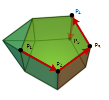

# Simplex

<a name="readme-top"></a>

<!-- PROJECT LOGO -->
<br />
<div align="center">
  <a href="https://github.com/albertojc6/Simplex">
    
  </a>

<h3 align="center">Primal Simplex Algorithm</h3>
</div>

<!-- TABLE OF CONTENTS -->
<details>
  <summary>Table of Contents</summary>
  <ol>
    <li>
      <a href="#about-the-project">About The Project</a>
    </li>
    <li>
      <a href="#getting-started">Getting Started</a>
      <ul>
        <li><a href="#prerequisites">Prerequisites</a></li>
        <li><a href="#installation">Installation</a></li>
      </ul>
    </li>
    <li><a href="#usage">Usage</a></li>
    <li><a href="#repo-structures">Repository Structures</a></li>
    <li><a href="#contributing">Contributing</a></li>
    <li><a href="#contact">Contact</a></li>
  </ol>
</details>

<!-- ABOUT THE PROJECT -->
## About The Project

This report is the justification for the solution proposed by the problem raised. This is, programming the algorithm of the primal simplicity, in order to solve a set of linear optimization problems.

Among the objectives of the practice, the understanding of the operation of the simplex method stands out, as well as the theoretical concepts associated with linear programming. In our case, the chosen programming language has been Python. Despite not being a language intended for mathematics, its module Numpy allows us to perform numerical calculations efficiently.

<p align="right">(<a href="#readme-top">back to top</a>)</p>

<!-- GETTING STARTED -->
## Getting Started

To get a local copy up and running follow these simple example steps.

### Prerequisites


* Python
  ```sh
  pip install numpy
  ```

### Installation

1. Clone the repo
  ```sh
  git clone https://github.com/jordigb4/Simplex
  ```
<p align="right">(<a href="#readme-top">back to top</a>)</p>


<!-- USAGE EXAMPLES -->
## Usage

```python
from Simplex import Simplex
from Parser import parse

c, A, b = parse('Data/ProblemData1.txt')
sim = Simplex(c, A, b, debug_file = 'Debug_ProblemData1')
i_B, x_B = sim.solve()
```

<p align="right">(<a href="#readme-top">back to top</a>)</p>

## Repository Structures

    .
    ├── Datos                 # Problem data examples
    ├── Debug_Datos           # Problem data examples solved
    ├── images                # Project Logo
    ├── Parser.py             # File with function to read linear problem data into numpy arrays
    ├── Simplex.py            # MAIN file, with Simplex solver class
    ├── example.py            # Use-case example
    └── README.md

<p align="right">(<a href="#repo-structures">back to top</a>)</p>

<!-- CONTRIBUTING -->
## Contributing

Contributions are what make the open source community such an amazing place to learn, inspire, and create. Any contributions you make are **greatly appreciated**.

If you have a suggestion that would make this better, please fork the repo and create a pull request. You can also simply open an issue with the tag "enhancement".
Don't forget to give the project a star! Thanks again!

1. Fork the Project
2. Create your Feature Branch (`git checkout -b feature/AmazingFeature`)
3. Commit your Changes (`git commit -m 'Add some AmazingFeature'`)
4. Push to the Branch (`git push origin feature/AmazingFeature`)
5. Open a Pull Request

<p align="right">(<a href="#readme-top">back to top</a>)</p>

<!-- CONTACT -->
## Contact

Jordi Granja Bayot - jordi.granja.i@estudiantat.upc.edu - @jordigb4  
Alberto Jerez Cubero - alberto.jerez@estudiantat.upc.edu - @albertojc6

Project Link: [https://github.com/jordigb4/Simplex](https://github.com/jordigb4/Simplex)

<p align="right">(<a href="#readme-top">back to top</a>)</p>